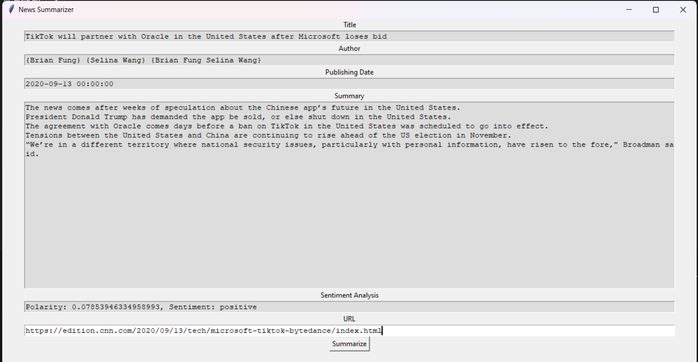

# League of Legends Winning Prediction Model

## Overview
This project aims to predict the winning team in League of Legends games using machine learning techniques. The analysis and modeling are conducted in a Jupyter Notebook, leveraging Python libraries such as Pandas, Matplotlib, and Seaborn.

## Technologies Used
- **Python**
- **Jupyter Notebook**
- **Pandas**
- **Matplotlib**
- **Seaborn**

## Features
- **Data Preprocessing**: Cleaning and preparing match data for analysis.
- **Exploratory Data Analysis (EDA)**: Visualizing key game metrics to understand data patterns.
- **Machine Learning Modeling**: Implementing and evaluating various algorithms to predict the winning team.

## Installation
1. Clone the repository:
    ```bash
    git clone https://github.com/yourusername/league-of-legends-prediction.git
    ```
2. Navigate to the project directory:
    ```bash
    cd league-of-legends-prediction
    ```
3. Install the required dependencies:
    ```bash
    pip install -r requirements.txt
    ```

## Usage
1. Open the Jupyter Notebook:
    ```bash
    jupyter notebook main.ipynb
    ```
2. Follow the steps in the notebook to preprocess data, perform EDA, and build prediction models.

## Dataset
The dataset used in this project is `games.csv`, containing match data with various features that influence the game's outcome.

## Visualization Examples

*Figure 1: Key game metrics visualized using Matplotlib and Seaborn.*

## License
This project is licensed under the MIT License. See the [LICENSE](LICENSE) file for details.

## Acknowledgments
- Special thanks to the open-source community for providing invaluable resources and tools.
- Inspired by the competitive spirit of the League of Legends gaming community.
